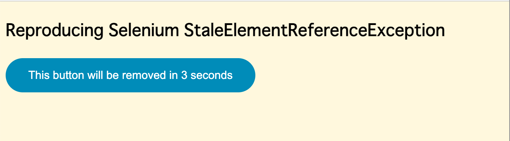
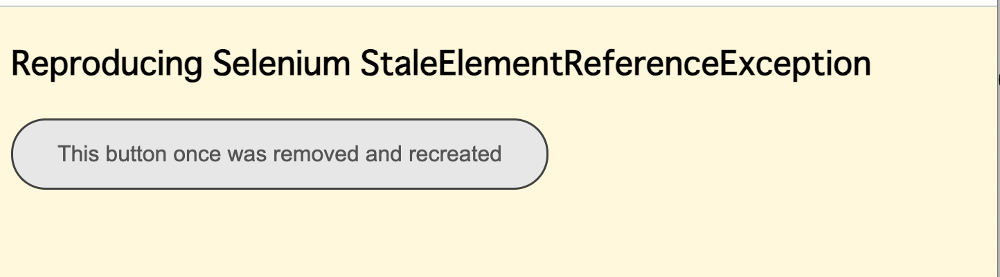

= Reproducing Selenium StaleElementReferenceException in Katalon Studio

- @author kazurayam
- @date Dec 2024

This is a small https://katalon.com/katalon-studio[Katalon Studio] project for demonstration purpose. You can download the zip of this repository from the https://github.com/kazurayam/StaleElementReferenceExceptionReproduction/releases[Releases] page, download it, unzip it, open it with your local Katalon Studio.

This Katalon project provides a few sample codes which can firmly reproduce the Selenium https://javadoc.io/doc/org.seleniumhq.selenium/selenium-api/latest/org/openqa/selenium/StaleElementReferenceException.html[StaleElementReferenceException].

I created this project using Katalon Studio v10.0.0 on macOS 14.7.1 with Chrome browser v131. But this project has no dependency to the katalon versions and platforms. You should be able to run this on any version of Katalon Studio on any OS using any browser.

== Achronim "SERE"

I would use an achronym "SERE" (**S**tale **E**lement **R**eference **E**xception) in this article for short.

== Problem to solve

In the https://forum.katalon.com/[Katalon Community], there a lot of topics about SERE:

- https://forum.katalon.com/t/unable-to-catch-staleelementreferenceexception-using-try-catch-mehcanism/100180[Unable to catch StaleElementReferenceException using try/catch mehcanism]
- https://forum.katalon.com/t/katalon-studio-fails-to-handle-staleelementreferenceexception/156753[Katalon Studio Fails to Handle StaleElementReferenceException]
- https://forum.katalon.com/t/ways-to-fix-the-staleelementreferenceexception-and-similar-exception/112355[Ways to fix the StaleElementReferenceExcetpion (and similar exception)]
- https://forum.katalon.com/t/how-to-fix-staleelementreferenceexception-stale-element-reference-element-is-not-attached-to-the-page-document/63304[How to fix StaleElementReferenceException: stale element reference: element is not attached to the page document]
- https://forum.katalon.com/t/headless-chrome-browser-getting-staleelementreferenceexception-for-some-elements/47348[Headless Chrome Browser - getting StaleElementReferenceException for some elements]

Please make a search in the forum to look up more

The posters were eager how to find out some way to fix/manage/avoid SERE, and in most cases they failed. The topics they posted are still open (unresolved) today.

I found a common shortcoming in these posts about SERE. The original posters eagerly ask for help for fixing (avoiding) SERE in their own projects, but **they do not show any sample running code in Katalon Studio that enable you to reproduce the SERE.** Backed with no code examle, the discussions were ambiguous, resulting no concrete solutions what to do next.

== Reference

I refered to
https://www.baeldung.com/selenium-staleelementreferenceexception[Baeldung, Selenium StaleElementReferenceException] to understand what SERE is.

== Solution

In this project, I would show you several test scripts. *With these sample scripts, you can firmly reproduce SERE on your machine*. The scripts are clear and concise. If you read the codes carefully, you would understand how a StaleElementReferenceException is thrown by your test scripts.

== Decription

=== target.html

At first, I created a HTML file as the target of my tests. The file located in the project's folder: `<ProjectDir>/targetPage.html`.

You can see the source at GitHub

- https://github.com/kazurayam/StaleElementReferenceExceptionReproduction/blob/main/targetPage.html

The page will like this soon after the page is loaded:



But after 3 seconds, the `<button id='myButton>' element is silently removed. And the button is recreated soon. The content text and the style is slightly changed, but the `id` value remains the same.



The JavaScript in the target HTML changes the DOM dynamically.

[source,javascript]
----
include::../targetPage.html[lines=28..46]
----

=== Object Repository/myButton.rs

I created a Test Object named `myButton`, which contains a simple XPath expression:

```
//button[@id='myButton']
```

This XPath expression will select the button in the target page. The `<button id='myButton'>` keeps the `id` value unchanged before and after the DOM operation by JavaScript. Therefor the same xpath applies.

=== Test Cases/TC1

See the source of
https://github.com/kazurayam/StaleElementReferenceExceptionReproduction/blob/main/Scripts/TC1/Script1733315135629.groovy[Test Cases/TC1].

[source,groovy]
----
include::../Scripts/TC1/Script1733315135629.groovy[]
----

The TC1 does the following steps:

1. open browser, navigate to the targetPage.html, make sure the page is opened. Prepare a Test Object that selects the `<button id='myButton'>` element.
2. TC1 creates a variable named `myButtonWebElement` to which assigned an `org.openqa.selenium.WebElement` object that refers to the `<button id='myButton'>` element in the page.
3. TC1 intentionally waits for 5 seconds.
4. On the other hand, in the opened browser, 3 seconds after the page load, the `<button id='myButton'> in blue color is removed. And a new `<button id='myButton'>` is created and inserted into the page.
5. After 5 seconds of wait, TC1 calls `myButtonWebElement.click()`. At this call, a `StaleElementReferenceException` will be thrown.

See the console log emited by TC1:

[source,text]
----
12月 05, 2024 9:52:44 午後 com.kms.katalon.core.logging.KeywordLogger startTest
情報: START Test Cases/TC1
...
12月 05, 2024 9:52:59 午後 com.kms.katalon.core.logging.KeywordLogger logInfo
情報: An Exception was caught: org.openqa.selenium.StaleElementReferenceException: stale element reference: stale element not found in the current frame
  (Session info: chrome=131.0.6778.109)
For documentation on this error, please visit: https://www.selenium.dev/documentation/webdriver/troubleshooting/errors#stale-element-reference-exception
Build info: version: '4.22.0', revision: 'c5f3146703'
System info: os.name: 'Mac OS X', os.arch: 'x86_64', os.version: '14.7.1', java.version: '17.0.7'
Driver info: com.kms.katalon.selenium.driver.CChromeDriver
Command: [ac30658fb877503145f65a505a4902e5, clickElement {id=f.D3000530D4F4A376D08D574B93D847AB.d.2AC594D17950A4F164BD8602A5C7E00D.e.3}]
Capabilities {acceptInsecureCerts: false, browserName: chrome, browserVersion: 131.0.6778.109, chrome: {chromedriverVersion: 131.0.6778.87 (ce31cae94873..., userDataDir: /var/folders/7m/lm7d6nx51kj...}, fedcm:accounts: true, goog:chromeOptions: {debuggerAddress: localhost:63200}, networkConnectionEnabled: false, pageLoadStrategy: normal, platformName: mac, proxy: Proxy(), se:cdp: ws://localhost:63200/devtoo..., se:cdpVersion: 131.0.6778.109, setWindowRect: true, strictFileInteractability: false, timeouts: {implicit: 0, pageLoad: 300000, script: 30000}, unhandledPromptBehavior: ignore, webSocketUrl: ws://localhost:45754/sessio..., webauthn:extension:credBlob: true, webauthn:extension:largeBlob: true, webauthn:extension:minPinLength: true, webauthn:extension:prf: true, webauthn:virtualAuthenticators: true}
Element: [[CChromeDriver: chrome on mac (ac30658fb877503145f65a505a4902e5)] -> xpath: //button[@id='myButton']]
Session ID: ac30658fb877503145f65a505a4902e5 <<<
12月 05, 2024 9:52:59 午後 com.kms.katalon.core.logging.KeywordLogger endTest
情報: END Test Cases/TC1
----

The variable `myButtonWebElement` is an instance of `org.openqa.selenium.WebElement` class. The variable got the valid reference initially. But after 5 seconds of wait, **the reference to the `<button id='myButton'>` element became stale because the target Web page dynamically changed its internal state**. This is the core reason why a `StaleElementReferenceException` is thrown.

=== Test Cases/TC2

Let me show you another sample code. The TC1 refered to a variable declared as an instance of `org.openqa.selenium.WebElement` class. But an usual Katalon Studio user does not write a Test Case in this way. They will primarily use `WebUI.*` keywords. The next TC2 calls `WebUI` keywords (no call to the Selenium API), and it can reproduce StaleElementReferenceException.

See the source of https://github.com/kazurayam/StaleElementReferenceExceptionReproduction/blob/main/Scripts/TC2/Script1733285851173.groovy[Test Cases/TC2].

[source,groovy]
----
include::../Scripts/TC2/Script1733285851173.groovy[]
----

When I ran the `TC2`, I saw the following messages in the console. You see, a SERE was thrown.

[source]
----
12月 05, 2024 10:01:44 午後 com.kms.katalon.core.logging.KeywordLogger startTest
情報: START Test Cases/TC2
...
12月 05, 2024 10:01:54 午後 com.kms.katalon.core.logging.KeywordLogger logFailed
重大: ❌ Unable to wait for object 'Object Repository/myButton' to be not clickable (Root cause: com.kms.katalon.core.exception.StepFailedException: Unable to wait for object 'Object Repository/myButton' to be not clickable
	at com.kms.katalon.core.webui.keyword.internal.WebUIKeywordMain.stepFailed(WebUIKeywordMain.groovy:117)
	at com.kms.katalon.core.webui.keyword.internal.WebUIKeywordMain.runKeyword(WebUIKeywordMain.groovy:43)
	at com.kms.katalon.core.webui.keyword.internal.WebUIKeywordMain$runKeyword.call(Unknown Source)
	at com.kms.katalon.core.webui.keyword.builtin.WaitForElementNotClickableKeyword.waitForElementNotClickable(WaitForElementNotClickableKeyword.groovy:108)
	at com.kms.katalon.core.webui.keyword.builtin.WaitForElementNotClickableKeyword.execute(WaitForElementNotClickableKeyword.groovy:69)
	at com.kms.katalon.core.keyword.internal.KeywordExecutor.executeKeywordForPlatform(KeywordExecutor.groovy:74)
	at com.kms.katalon.core.webui.keyword.WebUiBuiltInKeywords.waitForElementNotClickable(WebUiBuiltInKeywords.groovy:597)
	at TC2.run(TC2:47)
  ...
Caused by: org.openqa.selenium.StaleElementReferenceException: stale element reference: stale element not found in the current frame
  (Session info: chrome=131.0.6778.109)
  ...
==========================================================================
>>> An Exception was caught: com.kms.katalon.core.exception.StepFailedException: Unable to wait for object 'Object Repository/myButton' to be not clickable
===========================================================================
12月 05, 2024 10:01:55 午後 com.kms.katalon.core.logging.KeywordLogger endTest
情報: END Test Cases/TC2
----

Please find that the Exception was raised at `(WaitForElementNotClickableKeyword.groovy:108)`. So we should check the source code of Katalon Studio at https://github.com/kazurayam/StaleElementReferenceExceptionReproduction/blob/main/docs/10.0.0/source/com.kms.katalon.core.webui/com/kms/katalon/core/webui/keyword/builtin/WaitForElementNotVisibleKeyword.groovy[`com.kms.katalon.core.webui.keyword.builtin.WaitForElementNotClickableKeyword`]

[source,java]
----
package com.kms.katalon.core.webui.keyword.builtin
...
public class WaitForElementNotClickableKeyword extends WebUIAbstractKeyword {
    ..
    public boolean waitForElementNotClickable(TestObject to, int timeOut, FailureHandling flowControl) throws StepFailedException {
        return WebUIKeywordMain.runKeyword({
            ...
            try {
                ...
                try {
                    ...
                    WebElement foundElement = WebUIAbstractKeyword.findWebElement(to, timeOut)   // Line#103
                    WebDriverWait wait = new WebDriverWait(DriverFactory.getWebDriver(), Duration.ofSeconds(timeOut))
                    foundElement = wait.until(new ExpectedCondition<WebElement>() {
                                @Override
                                public WebElement apply(WebDriver driver) {
                                    if (foundElement.isEnabled()) {    // Line#108
                                        return null
                                    } else {
                                        return foundElement
                                    }
                                }
                            })
                    ...
                    return true
                } catch (WebElementNotFoundException e) {
                    ...
                    return false
                } catch (TimeoutException e) {
                    ...
                    return false
                }
            } finally {
                ...
            }
        }, ...)
    }
}
----

Why a StaleElementReferenceException was thrown at the Line#108?

At the Line#103, a variable named `foundElement` is declared to have a reference to a `org.openqa.selenium.WebElement` object, which points to the `<button id='myButton'>` element in the target page.

At the Line#108, the `WebUI.waitForElementNotClickable` keyword repeats referring to the `foundElement` until it finds "web element is not clickable any more". In fact, the TC2 instructs the keyword is told to wait with 10 seconds timeout.

While the keyword is in the loop, in the target web page, the intial `<button id='myButton'>` element is once removed; and a new `<button id='myButton'>` element is inserted. Therefore the `WebUI.waitForElementNotClickable` keyword threw a StaleElementReferenceException.

The same senario as TC1 applies to the TC2 as well.

=== Test Cases/TC3

=== Test Cases/TC4

== Conclusion

If you encountered a StaleElementReferenceException, you need to study how your target web page is written, especially how JavaScript works inside the page. Unless you understand how your target web page is dynamically modifed by JavaScript, you would not be able to avoid StaleElementReferenceException to occure in your Katalon project. Without knowing the internal of your target web page, it is impossible fix that issue. You should not blame Katalon Studio that it does not help you much for resolving issues about SERE.
